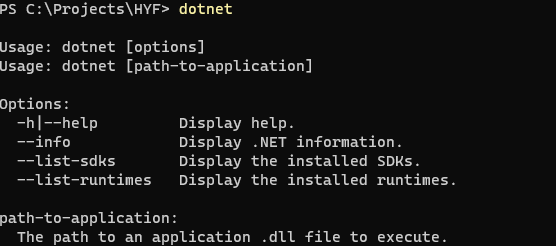

## How to get started

🎉 We are excited to have you onboard. Start by installing .NET on your machine:

- Go to [https://dotnet.microsoft.com/en-us/download](https://dotnet.microsoft.com/en-us/download)
- Click on download .NET SDK x64 button

- Start installation
- Verify that .NET has been installed by running `dotnet` command in console. You should see this result in the console

- Install C# extension for Visual Studio Code

