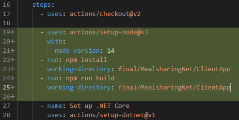

## Deployment

### Create resource group
1. Login into Azure portal
2. Create new resource group


3. Fill in resource group name and region


4. Click `Review + Create` button on the bottom of the page


5. Again, click `Create` button on the bottom of the page

### Create MySQL server
1. Create new MySql Single server. In the search field type ` server`,


2. Click `Create`


3. Select `Single server` and click `Create`


4. Fill in required fields. Make sure to select `Sweden Central` for Location. Remember username & password, we will need it later.


5. Click `Review + Create` on the bottom of the page

6. Click `Create` on the bottom of the page

7. Wait for the server to get deployed (it will take some time)


### Configure MySQL

1. Select `MySQL` server from the Azure dashboard


2. Select `Connection security`


3. Click `Add 0.0.0.0 - 255.255.255.255` from the `Firewall rules` section


4. Click `Continue`


5. Save the firewall rule


### Create database on Azure MySQL Server

1. Select `MySQL` server from the Azure dashboard


2. Copy server name


3. Open SQL management tool (MySQL workbench)
4. Create a new connection


5. Paste the server name from the clipboard into `Hostname` field, enter the username in `username` field and then test the connection. Username should be in `{username}@{mysql_instance_name}` format. You can find this in the `Connection strings` section on Azure.


6. Execute DB Schema creation script. Make sure that you have correct DB name. DB name should correspond to the DB name used in the connection string inside of the meal sharing .NET app code.


### Create App Service
1. Create a new App Service


2. Fill in required fields & click `Next: deployment`


3. Enable GitHub actions, fill in the required fields & click `Next: Networking`


4. Click on `Review + Create` on the bottom of the page
5. Click `Create`

### Update meal-sharing app
1. `App Service` creation process will create the GitHub action deployment workflow inside of the `.github` folder. Github action workflow assumes that your solution is located inside of the repository root, because of this deployment will probably fail (image).


To fix this we have to modify GitHub action.
2. Inside of the root repository open & edit GitHub action workflow `.github/workflow`


There are two steps that need to be modified - `Build with dotnet` and `dotnet publish`. Insert the path to the meal-sharing .NET project.


Commit and observe the deployment status


If fix is successful, GitHub status check should be green


3. To ensure that deployment will also contain client bundles, add these lines after the checkout step in the GitHub action workflow:

```yaml
- uses: actions/setup-node@v3
  with:
    node-version: 14
- run: npm install
  working-directory: final/MealsharingNet/ClientApp
- run: npm run build
  working-directory: final/MealsharingNet/ClientApp
```



4. Commit changes
5. Add the connection string as environment variable to `App Service`


make sure to  enter correct username, password and database name


6. Modify code to read connection string from the environment variable
```csharp
public class Shared
{
  public static string ConnectionString = string.IsNullOrEmpty(Environment.GetEnvironmentVariable("MYSQLCONNSTR_MealSharingDb")) ?
 "Server=localhost;Database=final-semih;Uid=root;Pwd=compl3xPassWrd;Convert Zero Datetime=True"   :
 Environment.GetEnvironmentVariable("MYSQLCONNSTR_MealSharingDb");
}
```
7. Commit changes, wait for the deployment to finish - test application!


