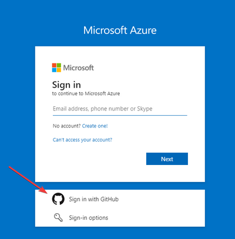
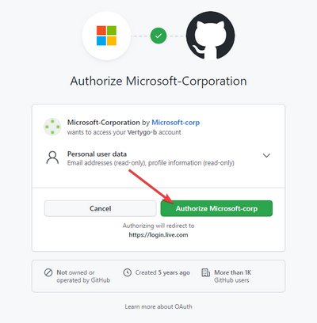
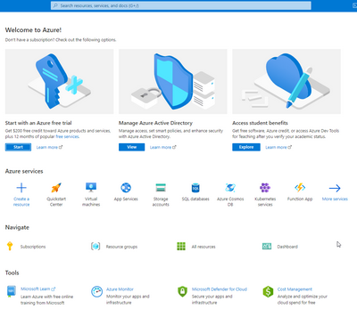
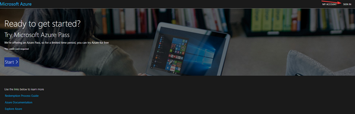
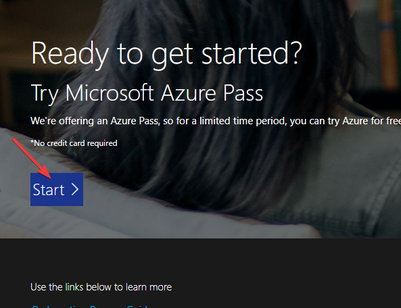
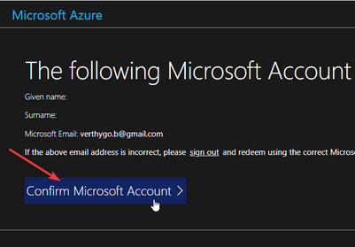
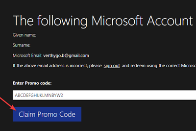
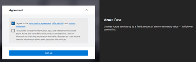

## Preparation

### Creating new Azure account
1. Register on Azure by going to https://portal.azure.com/
2. Register using your GitHub account

3. Approve Azure access to your GitHub account

4. Once all subsequent steps are done you should be able to see the Azure Dashboard

### Redeeming Azure code

1. Go to https://www.microsoftazurepass.com/ and sign-in

2. Click on the start

3. Click on `Confirm Microsoft Account`

4. Enter promo code and click `Claim Promo Code` (processing promo code might take some time)

5. Compleate signup. This proces might take some time to finish but after it is done you will be automatically redirected to the Azure portal

 
